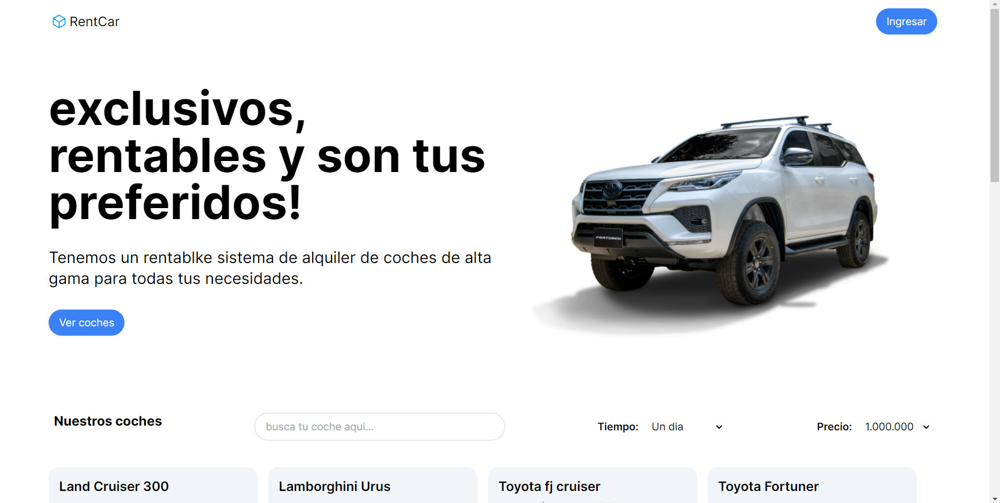
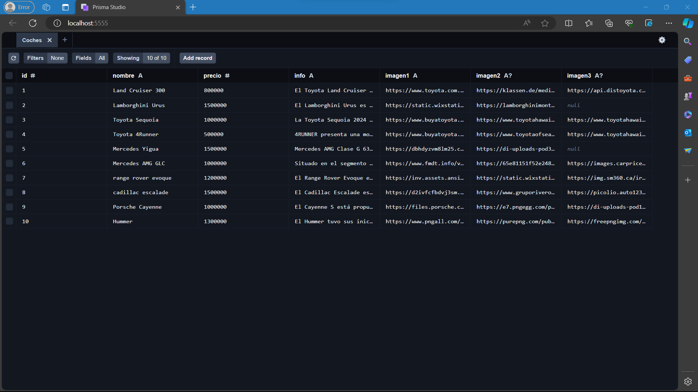

# cars
 
</img>

## Que es?

Este es un proyecto en el cual queria aprender mucho mas de nextjs y retarme a tomar desafios mas grandes.

## Contenido

Es una idea de negocio que consiste en un alquiler de coches de Alta gama en la ciudad de Medellin para turistas

Este sitio web fue creado con JSX, NEXTJS, TAILWIND y PRISMA 

## Manual de uso:

+ Se requiere node.js en su maquina y lo basico de js

</img>

